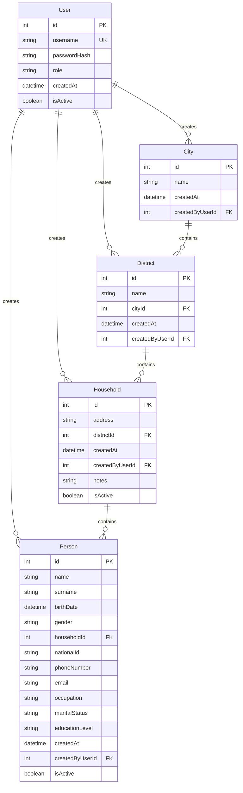

# 🏛️ Açık Kaynak Nüfus Sayım Platformu

Kamu kurumlarının dijital olarak nüfus verilerini toplayabilmesini, güncelleyebilmesini ve denetleyebilmesini sağlayan modern, güvenli ve ölçeklenebilir açık kaynak platform.

## 🎯 Proje Amacı

Bu platform, geleneksel kağıt tabanlı nüfus sayım süreçlerini dijitalleştirerek:
- ⚡ Veri toplama sürecini hızlandırır
- 📊 Gerçek zamanlı istatistikler sunar
- 🔒 Veri güvenliğini sağlar
- 👥 Rol tabanlı erişim kontrolü sunar
- 📱 Modern ve kullanıcı dostu arayüz sağlar

## 🏗️ Teknoloji Yığını

### Backend
- **Framework**: ASP.NET Core 8.0
- **Database**: SQL Server (MSSQL)
- **ORM**: Entity Framework Core
- **Authentication**: JWT Bearer Token
- **API Documentation**: Swagger/OpenAPI
- **Security**: BCrypt password hashing

### Frontend
- **Framework**: React 18 + TypeScript
- **Build Tool**: Vite
- **Styling**: TailwindCSS
- **Routing**: React Router v6
- **State Management**: React Context API
- **HTTP Client**: Axios
- **Forms**: React Hook Form
- **Icons**: Lucide React
- **Notifications**: React Hot Toast

### Infrastructure
- **Containerization**: Docker & Docker Compose
- **Web Server**: Nginx (for frontend)
- **Development**: Hot reload for both frontend and backend

## 👤 Kullanıcı Rolleri

### 🔴 Admin (Yönetici)
- Görevli kullanıcıları yönetir
- Tüm verilere erişim
- Sistem istatistiklerini görüntüler
- Kullanıcı yetkilendirme

### 🟡 Görevli (Memur)
- Nüfus bilgisi girer
- Hane ekler ve düzenler
- Kişi bilgilerini yönetir
- Bölgesel veri erişimi

### 🟢 Gözlemci (Misafir)
- Sadece veri okuma iznine sahip
- Raporları görüntüler
- İstatistikleri inceler
- Veri dışa aktarma

## 📊 Veri Yapısı



## 🚀 Hızlı Başlangıç

### Gereksinimler
- Docker & Docker Compose
- .NET 8 SDK (yerel geliştirme için)
- Node.js 18+ (yerel geliştirme için)

### 1. Projeyi Klonlayın
```bash
git clone https://github.com/your-org/nufus-sayim-platformu.git
cd nufus-sayim-platformu
```

### 2. Docker ile Çalıştırın
```bash
# Tüm servisleri başlat
docker-compose up -d

# Logları görüntüle
docker-compose logs -f
```

### 3. Uygulamaya Erişim
- **Frontend**: http://localhost:3000
- **Backend API**: http://localhost:5000
- **API Dokümantasyonu**: http://localhost:5000

### 4. Demo Hesap
```
Kullanıcı Adı: admin
Şifre: admin123
Rol: Admin
```

## 🔧 Yerel Geliştirme

### Backend
```bash
cd backend/NufusSayimAPI
dotnet restore
dotnet run
```

### Frontend
```bash
cd frontend
npm install
npm run dev
```

## 📡 API Endpoints

### Authentication
- `POST /api/auth/login` - Kullanıcı girişi
- `POST /api/auth/register` - Yeni kullanıcı kaydı
- `GET /api/auth/me` - Mevcut kullanıcı bilgileri

### Cities (Şehirler)
- `GET /api/cities` - Tüm şehirler
- `POST /api/cities` - Yeni şehir oluştur
- `GET /api/cities/{id}` - Şehir detayları
- `GET /api/cities/{id}/districts` - Şehir ilçeleri

### Districts (İlçeler)
- `GET /api/districts` - Tüm ilçeler
- `POST /api/districts` - Yeni ilçe oluştur
- `GET /api/districts/{id}` - İlçe detayları
- `GET /api/districts/{id}/households` - İlçe haneleri

### Households (Haneler)
- `GET /api/households` - Tüm haneler (filtrelenebilir)
- `POST /api/households` - Yeni hane oluştur
- `GET /api/households/{id}` - Hane detayları
- `PUT /api/households/{id}` - Hane güncelle
- `DELETE /api/households/{id}` - Hane sil (soft delete)

### People (Kişiler)
- `GET /api/people` - Tüm kişiler (filtrelenebilir)
- `POST /api/people` - Yeni kişi oluştur
- `GET /api/people/{id}` - Kişi detayları
- `PUT /api/people/{id}` - Kişi güncelle
- `DELETE /api/people/{id}` - Kişi sil (soft delete)
- `GET /api/people/search` - Kişi arama

### Statistics (İstatistikler)
- `GET /api/statistics` - Genel istatistikler
- `GET /api/statistics/city/{id}` - Şehir istatistikleri
- `GET /api/statistics/district/{id}` - İlçe istatistikleri
- `GET /api/statistics/demographics` - Demografik veriler

## 🔒 Güvenlik Özellikleri

- **JWT Authentication**: Güvenli token tabanlı kimlik doğrulama
- **Role-based Authorization**: Rol tabanlı erişim kontrolü
- **Password Hashing**: BCrypt ile güvenli şifre saklama
- **Input Validation**: Kapsamlı veri doğrulama
- **CORS Protection**: Cross-origin istek koruması
- **SQL Injection Protection**: Entity Framework ORM koruması
- **XSS Protection**: Frontend input sanitization

## 📊 Özellikler

### ✅ Tamamlanan Özellikler
- 🔐 JWT tabanlı kimlik doğrulama sistemi
- 👥 Rol tabanlı kullanıcı yönetimi (Admin, Görevli, Gözlemci)
- 🏙️ Şehir ve ilçe yönetimi
- 🏠 Hane kayıt ve yönetim sistemi
- 👤 Kişi bilgileri yönetimi
- 🔍 Gelişmiş arama ve filtreleme
- 📊 Gerçek zamanlı istatistikler ve raporlar
- 📱 Responsive ve modern UI tasarımı
- 🐳 Docker containerization
- 📚 Swagger API dokümantasyonu
- 🔄 Soft delete functionality
- 📝 Detaylı form validasyonları
- 🎨 Modern TailwindCSS tasarımı

### 🎯 Gelecek Özellikler
- 📊 Grafik ve chart entegrasyonu
- 📄 PDF rapor oluşturma
- 📤 Excel/CSV veri dışa aktarma
- 🔔 Bildirim sistemi
- 📱 PWA (Progressive Web App) desteği
- 🌐 Çoklu dil desteği
- 🔍 Gelişmiş arama filtreleri
- 📋 Bulk veri import/export
- 📊 Dashboard widget sistemi

## 🗂️ Proje Yapısı

```
nufus-sayim-platformu/
├── backend/
│   └── NufusSayimAPI/
│       ├── Controllers/         # API Controllers
│       ├── Models/             # Entity models
│       ├── DTOs/               # Data Transfer Objects
│       ├── Data/               # Database context
│       ├── Services/           # Business logic services
│       ├── Program.cs          # App configuration
│       └── Dockerfile
├── frontend/
│   ├── src/
│   │   ├── components/         # React components
│   │   ├── pages/             # Page components
│   │   ├── contexts/          # React contexts
│   │   ├── services/          # API services
│   │   ├── types/             # TypeScript interfaces
│   │   └── App.tsx
│   ├── nginx.conf
│   └── Dockerfile
├── docker-compose.yml
└── README.md
```

## 🤝 Katkıda Bulunma

1. Bu repository'yi fork edin
2. Yeni bir feature branch oluşturun (`git checkout -b feature/amazing-feature`)
3. Değişikliklerinizi commit edin (`git commit -m 'Add some amazing feature'`)
4. Branch'inizi push edin (`git push origin feature/amazing-feature`)
5. Bir Pull Request oluşturun

## 📝 Lisans

Bu proje MIT lisansı altında lisanslanmıştır. Detaylar için [LICENSE](LICENSE) dosyasına bakınız.

## 👥 Geliştirici Ekibi

- **Backend Development**: ASP.NET Core, Entity Framework
- **Frontend Development**: React, TypeScript, TailwindCSS
- **DevOps**: Docker, CI/CD
- **UI/UX Design**: Modern web tasarım prensipleri

## 📞 İletişim

- **Email**: developer@nufussayim.gov.tr
- **GitHub Issues**: [Issues sayfası](https://github.com/your-org/nufus-sayim-platformu/issues)
- **Dokümantasyon**: [Wiki sayfası](https://github.com/your-org/nufus-sayim-platformu/wiki)

## 🙏 Teşekkürler

Bu açık kaynak proje, modern web teknolojileri kullanılarak kamu hizmetlerinin dijitalleşmesine katkıda bulunmayı amaçlamaktadır.

---

**🚀 Proje Durumu**: ✅ Production Ready  
**🔖 Versiyon**: v1.0.0  
**📅 Son Güncelleme**: Aralık 2024
